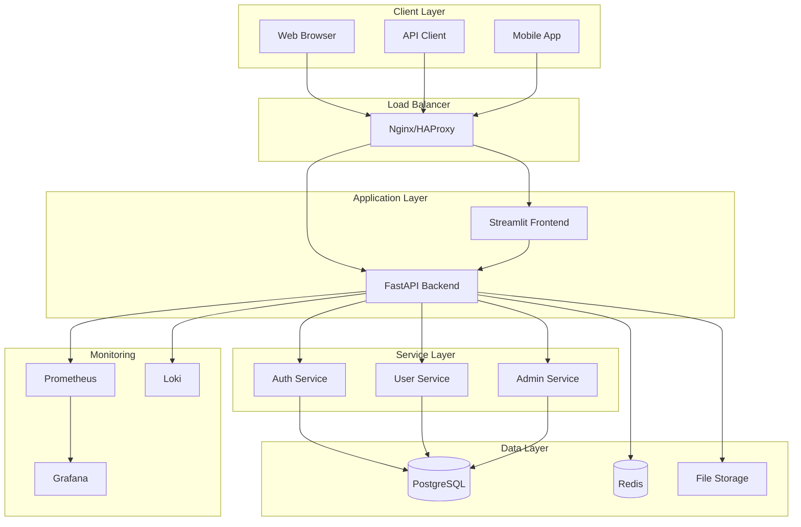
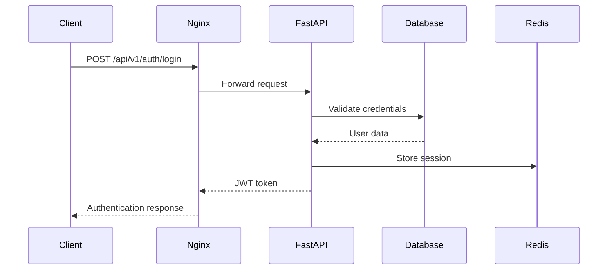
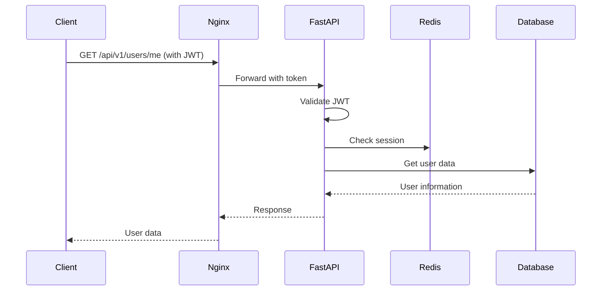
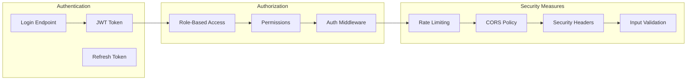
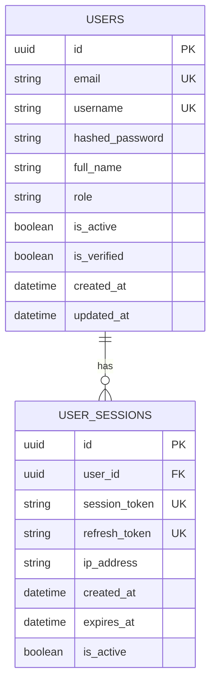
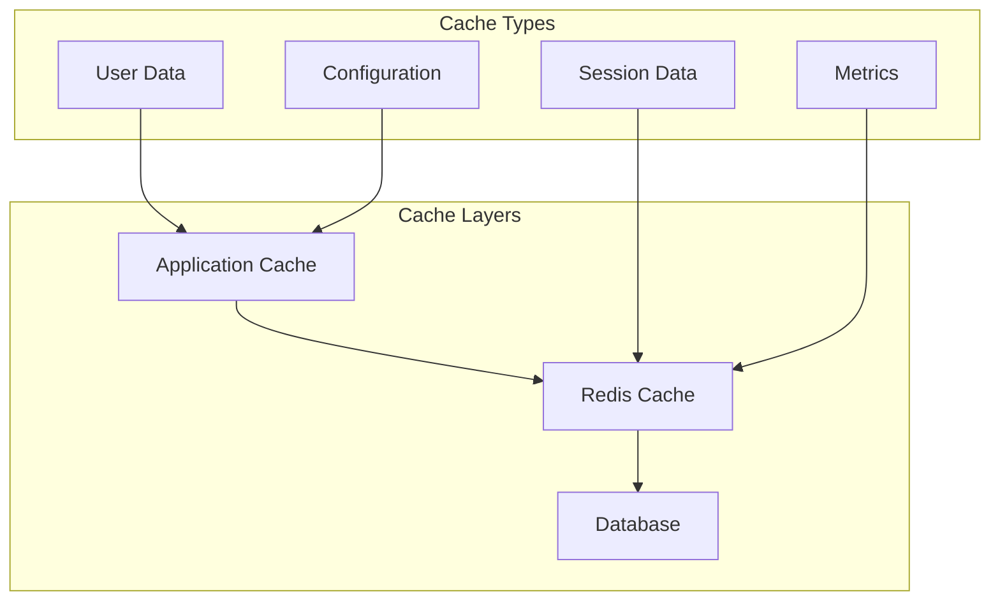
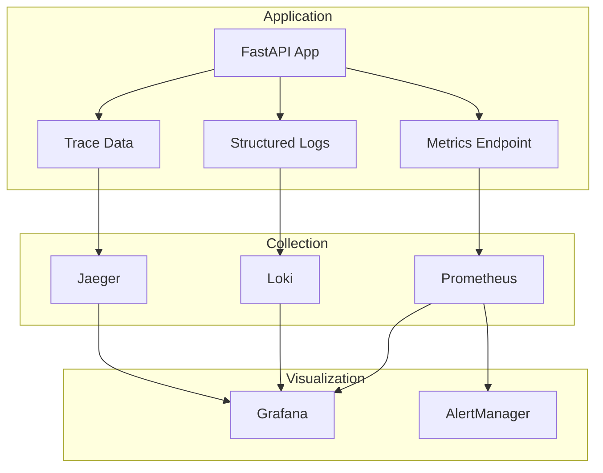
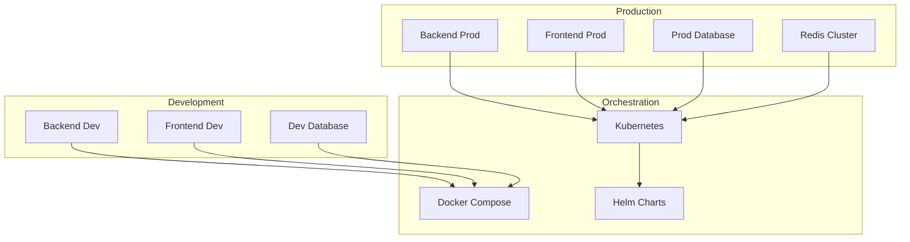
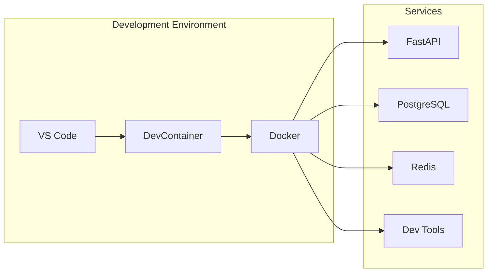

# 🏗️ FastAPI Enterprise MVP - Architecture Documentation

## 📋 System Overview

This document describes the architecture of the FastAPI Enterprise MVP, a production-ready microservice application with comprehensive security, monitoring, and DevOps capabilities.

## 🎯 Design Principles

### 1. **Separation of Concerns**
- Clear separation between API, business logic, and data layers
- Modular design with well-defined interfaces
- Single responsibility principle throughout

### 2. **Security First**
- JWT-based authentication with role-based access control
- Input validation and sanitization
- Security headers and CORS configuration
- Rate limiting and DDoS protection

### 3. **Observability**
- Structured logging with correlation IDs
- Prometheus metrics for monitoring
- Health checks and readiness probes
- Distributed tracing capabilities

### 4. **Scalability**
- Stateless application design
- Database connection pooling
- Caching strategies with Redis
- Horizontal scaling support

### 5. **Developer Experience**
- DevContainer support for consistent development
- Comprehensive testing suite
- Auto-generated API documentation
- Hot reload in development

## 🏛️ System Architecture



## 📦 Component Architecture

### Backend (FastAPI)

```
backend/
├── app/
│   ├── api/                    # API layer
│   │   ├── v1/
│   │   │   ├── endpoints/      # Route handlers
│   │   │   └── api.py          # Router configuration
│   │   └── dependencies.py     # Dependency injection
│   ├── core/                   # Core functionality
│   │   ├── config.py           # Configuration management
│   │   ├── security.py         # Security utilities
│   │   └── logging.py          # Logging configuration
│   ├── models/                 # Data models (SQLAlchemy)
│   ├── schemas/                # Pydantic schemas
│   ├── services/               # Business logic
│   └── utils/                  # Utility functions
├── tests/                      # Test suite
└── scripts/                    # Database scripts
```

### Frontend (Streamlit)

```
frontend/
├── app.py                      # Main application
├── components/                 # Reusable components
├── pages/                      # Page components
├── utils/                      # Utility functions
└── static/                     # Static assets
```

## 🔄 Request Flow

### 1. Authentication Flow



### 2. Protected Resource Access



## 🛡️ Security Architecture

### Authentication & Authorization



### Security Layers

1. **Network Security**
   - HTTPS/TLS encryption
   - Firewall rules
   - VPN access for admin

2. **Application Security**
   - JWT token authentication
   - Role-based access control
   - Input validation and sanitization
   - SQL injection prevention

3. **Infrastructure Security**
   - Container security scanning
   - Secrets management
   - Network segmentation
   - Regular security updates

## 📊 Data Architecture

### Database Design



### Caching Strategy



## 🔍 Monitoring Architecture

### Observability Stack



### Key Metrics

1. **Application Metrics**
   - Request rate and latency
   - Error rates by endpoint
   - Active user sessions
   - Database query performance

2. **Infrastructure Metrics**
   - CPU and memory usage
   - Disk I/O and network
   - Container health
   - Database connections

3. **Business Metrics**
   - User registrations
   - Login success/failure rates
   - Feature usage
   - API endpoint popularity

## 🚀 Deployment Architecture

### Container Strategy



### Scaling Strategy

1. **Horizontal Scaling**
   - Multiple backend instances
   - Load balancer distribution
   - Database read replicas
   - Redis clustering

2. **Vertical Scaling**
   - Resource optimization
   - Connection pooling
   - Query optimization
   - Caching improvements

## 🔧 Development Architecture

### DevContainer Setup



### Testing Strategy

1. **Unit Tests**
   - Individual function testing
   - Mock external dependencies
   - High code coverage

2. **Integration Tests**
   - API endpoint testing
   - Database integration
   - Service interaction

3. **End-to-End Tests**
   - Full user workflows
   - Browser automation
   - Performance testing

## 📈 Performance Considerations

### Optimization Strategies

1. **Database Optimization**
   - Proper indexing
   - Query optimization
   - Connection pooling
   - Read replicas

2. **Caching**
   - Application-level caching
   - Redis for session data
   - CDN for static assets
   - Database query caching

3. **API Optimization**
   - Async/await patterns
   - Response compression
   - Pagination
   - Field selection

## 🔮 Future Enhancements

### Planned Features

1. **Microservices Split**
   - Separate auth service
   - User management service
   - Notification service

2. **Advanced Security**
   - OAuth2 integration
   - Multi-factor authentication
   - API key management

3. **Enhanced Monitoring**
   - Custom dashboards
   - Automated alerting
   - Performance profiling

4. **Scalability Improvements**
   - Event-driven architecture
   - Message queues
   - Distributed caching
